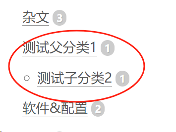
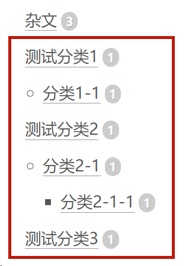

摘要: 分类有层级关系,多层级关系; 标签没层级关系
<!--more-->

## 分类及标签说明

```
categories:
  - 父分类1    分类有层级关系,父子关系,如图1
  - 子分类1-1
tags:
  - 测试标签1  标签没层级关系 ,都是平铺
  - 测试标签2
  - 测试标签3
```


```
categories:   分类有层级关系,多层级关系,如图2
 - [父分类1,分类1-1]
 - [父分类2,分类2-1,分类2-1-1]
 - 父分类3
 
 并列分类
 categories:
 - [父分类1]
 - [父分类2]
```






## 如何增加摘要

```
前面必须要有内容,要不不好使
<!--more-->
正文...
```


